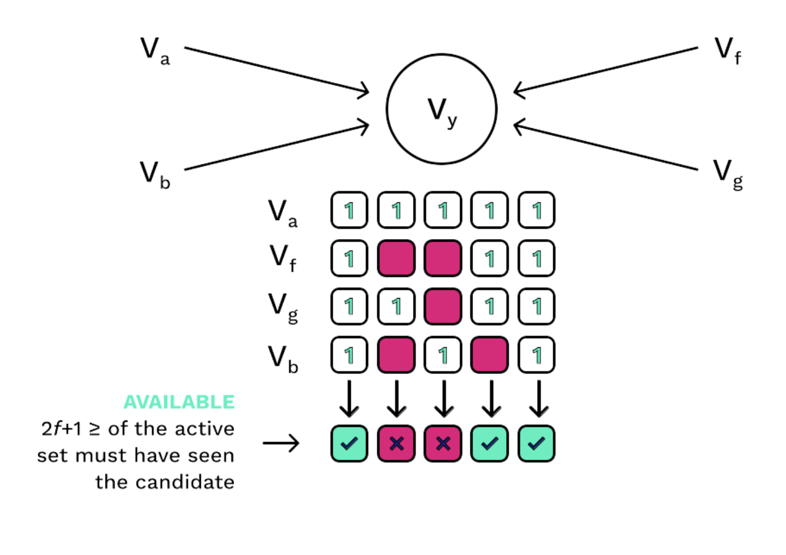

# Availability

After parachain block has been backed in the relay-chain it is considered pending availability.
Make availability data (PoV and Persisted Validation Data) widely available within the validator set, without requiring every node to retain a full copy.

Distribute  erasure-coded chunks of availability data, and track distribution using signed bitfields.
Enabling reassembling of complete PoV when required, for example when approval checker needs to validate a parachain block
   

Availability is handled by these subsystems:
- Availability Distribution subsystem
- Bitfield Signing subsystem
- Bitfield Distribution subsystem
- Availability Recovery subsystem
- Availability Store subsystem 

## Availability Distribution subsystem

- This subsystem is responsible for distribution of availability data to peers via request response protocols.

- Works with the Availability Store subsystem to handle requests by validators for availability data chunks.
- Requests chunks from backing validators to put them in their local Availability Store.
- Validator with index i gets chunk with the same index.

## Bitfield Signing subsystem

- For each fresh leaf, wait a fixed period of time for availability distribution to make candidate available.
- Validator with index i gets a chunk with the same index.
- Validators sign statements when they receive their chunk.

## [Bitfield Distribution subsystem](./bitfield-distribution.md)
- Validators vote on the availability of a backed candidate by issuing signed bitfields. 
This implements a gossip system.
- Before gossiping incoming bitfields, check if signed by validator in current validation set, only accept bitfields relevant to our current view and only distribute bitfields to other peers when relevant to their most recent view.
- Forward it along to the block authorship (provisioning) subsystem for potential inclusion in a block.

## Availability Thresholds Visualized

## Availability Recovery subsystem
- Responsible for recovering data made available via the availability distribution subsystem.
- Necessary for candidate validation during approval/disputes process
Also used by collators to recover PoVs in adversarial scenarios where other collators of the parachain are censoring blocks.

## Availability Store subsystem
- Uses a database to persist availability data.
- Keeps data available for use by other subsystems.
- Prunes data when no longer needed, after finalized plus time for handling disputes (25 hours after finalized)
